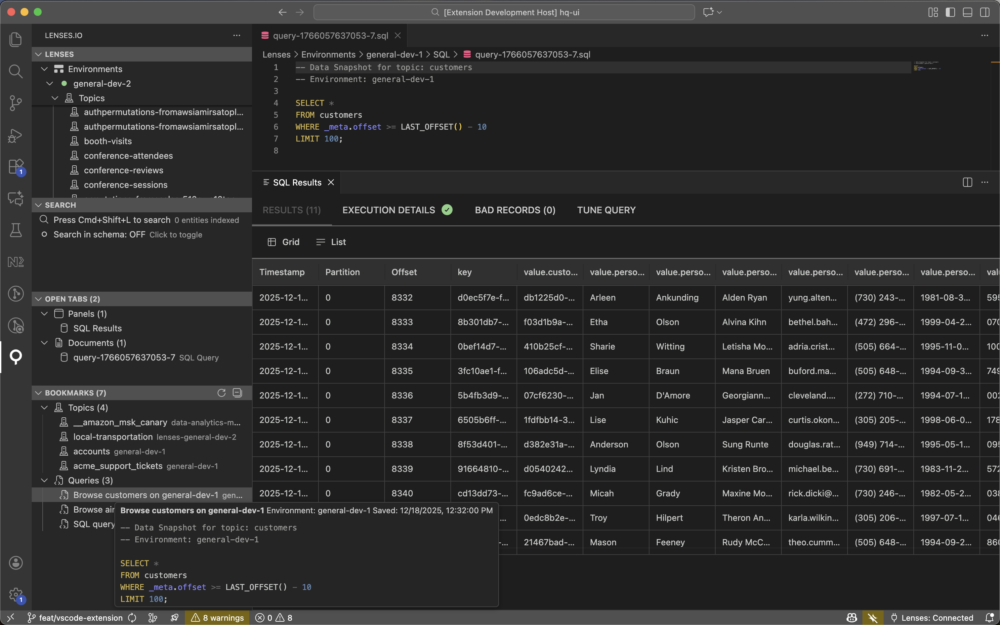

# Lenses.io for VS Code

<p align="center">
  
</p>

<p align="center">
  <strong>Manage your Apache Kafka infrastructure directly from Visual Studio Code</strong>
</p>

<p align="center">
  <a href="https://marketplace.visualstudio.com/items?itemName=lensesio.lenses-vscode">
    
  </a>
  <a href="https://open-vsx.org/extension/lensesio/lenses-vscode">
    
  </a>
  <a href="https://marketplace.visualstudio.com/items?itemName=lensesio.lenses-vscode">
    
  </a>
  <a href="https://marketplace.visualstudio.com/items?itemName=lensesio.lenses-vscode&ssr=false#review-details">
    
  </a>
</p>

<p align="center">
  <a href="#key-features">Features</a> •
  <a href="#installation">Installation</a> •
  <a href="#quick-start">Quick Start</a> •
  <a href="#commands">Commands</a> •
  <a href="#settings">Settings</a>
</p>

---

## Key Features

Lenses.io for VS Code brings the power of Lenses directly into your development environment. Query topics, manage IAM, compare configurations across environments, and monitor your Kafka infrastructure - all without leaving VS Code.

- **⚡ Environment Creation** — Create and provision new Kafka environments with guided workflow
- **⚡ Topic Creation** — Create new Kafka topics with full schema validation and autocompletion
- **⚡ Topic Insert Messages** — Insert messages into topics with schema validation and autocompletion
- **⚡ Tree View Navigation** — Browse environments, topics, schemas, connectors, and IAM resources
- **⚡ Topic actions from breadcrumbs** — Click the topic segment in the editor breadcrumb (or use **Lenses: Topic Actions** in the editor title) to run the same commands as the tree topic menu (data snapshot, configuration, insert messages, etc.)
- **⚡ Real-time SQL Queries** — Query topics with Data Snapshot or stream live data in real-time
- **⚡ Bookmarks & Saved Queries** — Bookmark topics and save SQL queries for quick access
- **⚡ IAM Management** — Create and manage users, groups, roles, and service accounts
- **⚡ Configuration Comparison** — Compare topics, schemas, groups, and roles across environments
- **⚡ Health Monitoring** — View Kafka health issues in VS Code's Problems panel
- **⚡ Global Search** — Instantly find any entity with fuzzy search (`Cmd+Shift+L`)
- **⚡ Copilot agent tools** — After connecting, use GitHub Copilot **Agent** chat with tools enabled: reference `#lensesExtensionSql`, `#lensesExtensionDoc`, `#lensesExtensionListing`, `#lensesExtensionTopic`, `#lensesExtensionEnv`, `#lensesExtensionCompare`, `#lensesExtensionSearch`, or `#lensesExtensionOps` to run Lenses SQL, open entities and listings, drive topic/environment flows, diffs, search/index, and more (VS Code 1.96+).

### GitHub Copilot / Language Model Tools

Connect to Lenses first. In Copilot Chat, enable **agent** mode and extension tools (see [Use tools in chat](https://code.visualstudio.com/docs/copilot/chat/chat-tools)). Destructive actions (for example delete topic or environment) still show VS Code confirmation dialogs before executing. Authentication commands are not available as tools. Requires **VS Code 1.96+**.

| Tool reference | Display name | What it does |
|---|---|---|
| `#lensesExtensionSql` | Run Lenses SQL | Opens the SQL editor for an environment and optionally runs a query immediately. Live streaming supported. |
| `#lensesExtensionDoc` | Open Lenses document | Opens any virtual document in view or edit mode — IAM entities (User, Group, Role, ServiceAccount), Topics, Connectors, Schemas, Provisioning, EnvironmentConfig, EnvironmentCreate, TopicCreate, TopicConfig. |
| `#lensesExtensionListing` | Open Lenses listing | Opens a listing panel: environments table, topics, IAM (users / groups / roles / service accounts), or the SQL Results panel. |
| `#lensesExtensionTopic` | Topic action | Runs a topic-scoped action: data snapshot, live data, schema view, consumers, configuration, insert messages, compare across environments, open SQL tab, delete topic (with confirmation), create topic, add bookmark. |
| `#lensesExtensionEnv` | Environment action | Switches the active environment, opens environment config or provisioning YAML, creates or deletes an environment (with confirmation), refreshes health. |
| `#lensesExtensionCompare` | Lenses comparison | Opens comparison wizards (topic config, topic schema, groups, roles) or performs a direct diff between two named entities across environments. |
| `#lensesExtensionSearch` | Lenses search & index | Opens the global search panel or drives search index actions (rebuild, start/stop/pause/resume indexing, validate, view stats). |
| `#lensesExtensionOps` | Lenses misc command | Miscellaneous commands: refresh tree/bookmarks/notifications, stop SQL, clear results, apply/save changes, schema version actions, connector/consumer group ops, notification management. |

---

## Installation

### From VS Code Marketplace

1. Open VS Code
2. Go to Extensions (`Cmd+Shift+X` / `Ctrl+Shift+X`)
3. Search for "**Lenses.io**"
4. Click **Install**

### From VSIX File

```bash
code --install-extension lenses-vscode-x.x.x.vsix
```

---

## Quick Start

### 1. Connect to Your Lenses Instance

Click the **Lenses.io** icon in the Activity Bar, then click **Connect to Lenses**.

<!-- Screenshot: Login flow -->
<!--  -->

Enter your:
- **URL** (e.g., `https://lenses.your-company.com`)
- **Username**
- **Password**

Or use **Sign in with OAuth (browser)** when your Lenses instance supports OAuth 2.0. Click the welcome link or run **Lenses: Sign in with OAuth (browser)** from the Command Palette. The extension opens your system browser for authentication and handles the callback automatically. If your server does not support dynamic client registration, set `lenses.oauthClientId` in VS Code settings.

### 2. Explore the Tree View

Once connected, you'll see your Kafka infrastructure organized in a tree:

<!-- Screenshot: Tree view -->
<!--  -->

- **Environments** — All connected Kafka environments with health status
- **Topics** — Browse topics across all environments
- **IAM** — Users, Groups, Roles, and Service Accounts

### 3. Query Your First Topic

Right-click any topic and select **Data Snapshot** to open a SQL query:

<!-- Screenshot: SQL Query -->


```sql
SELECT * FROM my-topic LIMIT 100;
```

Press `Cmd+Enter` to run the query. Results appear in a split view below the editor.

---

## Features

### Environments Dashboard

View all your Kafka environments with real-time health metrics and status indicators.

<!-- Screenshot: Environments listing -->


- Green/red status indicators for agent connectivity
- Real-time metrics (topics, partitions, messages)
- Click to explore topics within an environment

### Environment Creation

Create new Kafka environments with a guided workflow directly from VS Code.

<!-- Screenshot: Environment creation -->


1. Click the "+" icon on Environments or use Command Palette → **Lenses: Create Environment**
2. YAML editor for environment profile with full schema validation
3. After creation, deploy the agent: if your Lenses HQ is **local** (e.g. localhost or private network), you can run or paste a Docker command, **copy the agent key** for later, or skip. If you are connected to a **remote/cloud** HQ, the extension does not offer local Docker (it would not connect); you get a short explanation and can **copy the agent key** to deploy where your HQ can reach the agent.
4. When using local Docker from the extension, connection polling runs until the agent connects (or you cancel)
5. Transition to provisioning configuration once connected

The guided workflow walks you through environment definition and agent handoff; remote setups rely on copying the agent key into your own deployment process.

### Topic Creation

Create new Kafka topics directly from VS Code with full schema validation and autocompletion.


- Click the "+" icon on the Topics node, or use Command Palette → **Lenses: Create Topic**
- YAML editor with full schema validation and autocompletion
- Configure partitions, replication, and all Kafka topic settings
- Topic appears instantly in the tree after creation

### Topic Insert Messages

Insert messages directly into Kafka topics with full schema validation and autocompletion.


- Right-click any topic → **Insert Messages**
- JSON editor with real-time validation against topic schema
- Auto-generates sample messages based on AVRO/JSON schema
- Supports key, value, and optional headers
- Click the Play button to insert, then automatically view with SQL query
- Errors highlighted inline with Problems panel integration

### Topics & SQL Queries

Browse and query topics with the integrated SQL editor.

<!-- Screenshot: Topics listing -->


**Data Snapshot** — Query historical data with SQL:
```sql
SELECT * FROM orders WHERE amount > 1000 LIMIT 50;
```

**Live Data** — Stream new messages in real-time:
- Click "Live Data" on any topic
- Press Play to start streaming
- Only shows NEW messages as they arrive
- Press Stop to end the stream

Results display in a rich panel with:
- **Results** — Data grid with all message fields
- **Execution Details** — Query performance metrics
- **Bad Records** — Deserialization errors
- **Tune Query** — Optimize query settings

### Topic Configuration

Edit topic configurations directly in VS Code's native JSON editor.

<!-- Screenshot: Topic Configuration -->


- Side-by-side view: reference on left, editable config on right
- JSON schema validation with inline error highlighting
- Hover documentation for config properties
- Only modified values are sent to the API

### Topic Schema

View and manage topic schemas with version history.

<!-- Screenshot: Topic Schema -->


- Key and Value schemas
- Version dropdown for history
- Schema comparison between versions
- Full editing capabilities

### IAM Management

Manage identity and access directly from VS Code.

<!-- Screenshot: IAM -->


- **Users** — Create, view, and delete users
- **Groups** — Organize users into groups with role assignments
- **Roles** — Define permissions with fine-grained actions
- **Service Accounts** — Manage API access credentials

Features include:
- JSON editor with schema validation
- Autocompletion for role names and permissions
- Real-time updates across all open tabs

### Configuration Comparison

Compare entities across environments using VS Code's native diff editor.

<!-- Screenshot: Diff view -->


**Cross-environment comparisons:**
- Topics configuration
- Schemas (key and value)

**Global entity comparisons:**
- Groups
- Roles

Access via Command Palette or right-click context menu.

### Health Monitoring

Monitor Kafka infrastructure health in VS Code's Problems panel.

<!-- Screenshot: Health monitoring -->


- Consumer lag warnings and errors
- Connector failure alerts
- Environment connectivity issues
- Real-time toast notifications for critical issues

### Bookmarks & Saved Queries

Keep your frequently accessed topics and queries at your fingertips.



**Topic Bookmarks:**
- Right-click any topic → **Add to Bookmarks**
- Click a bookmarked topic to open a pre-configured SQL query
- Remove bookmarks with a single click

**Saved Queries:**
- Save any SQL query with `Cmd+Shift+P` → **Lenses: Save Query**
- Click the bookmark icon in the SQL editor
- Click a saved query to open it in a new tab
- Rename or delete saved queries from the context menu

All bookmarks and saved queries sync with your Lenses.io web app for seamless workflow across platforms.

### Global Search

Find any entity instantly with fuzzy search.

<!-- Screenshot: Global search -->
<!--  -->

- Press `Cmd+Shift+L` (`Ctrl+Shift+L` on Windows/Linux)
- Type to search across environments, topics, users, and more
- Results ranked by relevance
- Click to navigate directly to the entity

---

## Commands

Access all commands via the Command Palette (`Cmd+Shift+P` / `Ctrl+Shift+P`).

| Command | Description |
|---------|-------------|
| `Lenses: Connect to Instance` | Connect to your Lenses.io API |
| `Lenses: Sign in with OAuth (browser)` | Connect via OAuth 2.0 browser flow |
| `Lenses: Search` | Open global fuzzy search |
| `Lenses: Switch Environment` | Quick switch between environments |
| `Lenses: Create Environment` | Create a new environment |
| `Lenses: Create Topic` | Create a new Kafka topic |
| `Lenses: Save Query` | Save the current SQL query |
| `Lenses: Compare Topic Configuration` | Compare topic configs across environments |
| `Lenses: Compare Topic Schema` | Compare topic schemas across environments |
| `Lenses: Compare Groups` | Compare groups side by side |
| `Lenses: Compare Roles` | Compare roles side by side |
| `Lenses: Refresh Health Status` | Refresh health monitoring data |
| `Lenses: Open SQL Query` | Open a new SQL query editor |
| `Lenses: Run SQL Query` | Execute the current SQL query |
| `Lenses: Sign Out` | Disconnect from the Lenses instance |

---

## Keyboard Shortcuts

| Shortcut | Action |
|----------|--------|
| `Cmd+Shift+L` | Global Search |
| `Cmd+Shift+E` | Switch Environment |
| `Cmd+Shift+Q` | Open SQL Query |
| `Cmd+Enter` | Run SQL Query (in SQL editor) |

---

## Settings

Configure the extension via VS Code Settings (`Cmd+,`).

### General

| Setting | Default | Description |
|---------|---------|-------------|
| `lenses.apiUrl` | `""` | Base URL for your Lenses.io API |
| `lenses.oauthClientId` | `""` | OAuth client ID (when dynamic registration is unavailable) |

### Health Monitoring

| Setting | Default | Description |
|---------|---------|-------------|
| `lenses.health.pollingInterval` | `30000` | Health check interval (ms) |
| `lenses.health.consumerLagWarningThreshold` | `10000` | Consumer lag warning threshold |
| `lenses.health.consumerLagErrorThreshold` | `100000` | Consumer lag error threshold |
| `lenses.health.notifications.enabled` | `false` | Enable toast notifications for critical issues |
| `lenses.health.notifications.errorOnly` | `false` | Only show error notifications |
| `lenses.health.notifications.cooldownMs` | `300000` | Notification cooldown (5 min) |
| `lenses.health.notifications.showInStatusBar` | `true` | Show unread notification count in status bar |

### Health Checks

| Setting | Default | Description |
|---------|---------|-------------|
| `lenses.health.checks.consumerLag` | `true` | Monitor consumer lag |
| `lenses.health.checks.connectorStatus` | `true` | Monitor connector status |
| `lenses.health.checks.environmentStatus` | `true` | Monitor environment health |

### SQL Queries

| Setting | Default | Description |
|---------|---------|-------------|
| `lenses.sql.liveData.maxRecords` | `5000` | Maximum records for live data streaming (0 = no limit) |
| `lenses.sql.liveData.rateWarningEnabled` | `true` | Show warning when message rate is high |
| `lenses.sql.acceptSelfSignedCerts` | `false` | Trust self-signed TLS certificates for SQL connections |

### Search Index

| Setting | Default | Description |
|---------|---------|-------------|
| `lenses.search.index.enabledEntityTypes` | all types | Entity types to include in search index |
| `lenses.search.index.autoIndexOnStartup` | `false` | Automatically start indexing when connected |
| `lenses.search.cache.enabled` | `true` | Persist search index between sessions |
| `lenses.search.cache.ttlHours` | `24` | Search index cache duration (hours) |

### Other

| Setting | Default | Description |
|---------|---------|-------------|
| `lenses.yaml.schemaValidation` | `true` | YAML schema validation for provisioning files |
| `lenses.telemetry.enabled` | `true` | Anonymous usage telemetry (respects VS Code global setting) |

---

## Requirements

- **VS Code** 1.80.0 or higher
- **Lenses.io** instance with API access
- Network connectivity to your Lenses API

### Recommended Extensions

- [YAML](https://marketplace.visualstudio.com/items?itemName=redhat.vscode-yaml) — Enhanced YAML editing for environment configuration

---

## Version Compatibility

**Important:** The extension version must match your Lenses.io API version (minor version compatibility).

| Extension Version | Compatible API Version |
|-------------------|------------------------|
| 6.2.x             | 6.2.y                  |

The extension will check version compatibility when connecting and display a warning if there's a mismatch. While you can continue with mismatched versions, some features may not work correctly.

**Example:**
- Extension 6.2.0 ✅ API 6.2.1 (compatible)
- Extension 6.2.0 ⚠️ API 6.1.5 (warning shown)
- Extension 6.2.0 ⚠️ API 6.3.0 (warning shown)

---

## What's New

### Latest Release Highlights

- **Environment Creation** — Create and provision new Kafka environments with guided workflow
- **Topic Creation** — Create topics with full schema validation and autocompletion
- **Topic Insert Messages** — Insert messages with schema validation and sample generation
- **Bookmarks & Saved Queries** — Bookmark topics and save SQL queries for quick access
- **Live Data Streaming** — Real-time message streaming from topics
- **GitHub Copilot Integration** — Use Copilot agent tools to drive Lenses operations from chat
- **OAuth Browser Authentication** — Sign in via OAuth 2.0 with your system browser
- **Pin SQL Results** — Snapshot query results and compare across topics side-by-side

See the [CHANGELOG](CHANGELOG.md) for full release history.

---

## Troubleshooting

### Extension Doesn't Load

1. Ensure VS Code is version 1.80.0 or higher
2. Check the Output panel (`View → Output`) and select "Lenses.io" from the dropdown
3. Try reloading the window (`Cmd+Shift+P` → "Developer: Reload Window")

### Authentication Fails

1. Verify your URL points to the correct Lenses instance (e.g., `https://lenses.company.com`). The `/api` suffix is added automatically.
2. Check your username and password
3. Ensure your Lenses instance is accessible from your network

### Topics Not Loading

1. Check if the environment has an agent connected (green indicator)
2. Verify you have permissions to view topics
3. Try refreshing the node (right-click → Refresh)

---

## Support

- **Documentation**: [Lenses.io Docs](https://docs.lenses.io)
- **Issues**: [GitHub Issues](https://github.com/lensesio/lenses-vscode/issues)
- **Lenses.io**: [lenses.io](https://lenses.io)

---

## License

[Proprietary License](LICENSE) © 2017-2026 Lenses.io LTD

---

<p align="center">
  <sub>Built with ❤️ by the Lenses.io team</sub>
</p>
