# Lenses.io for VS Code

<p align="center">
  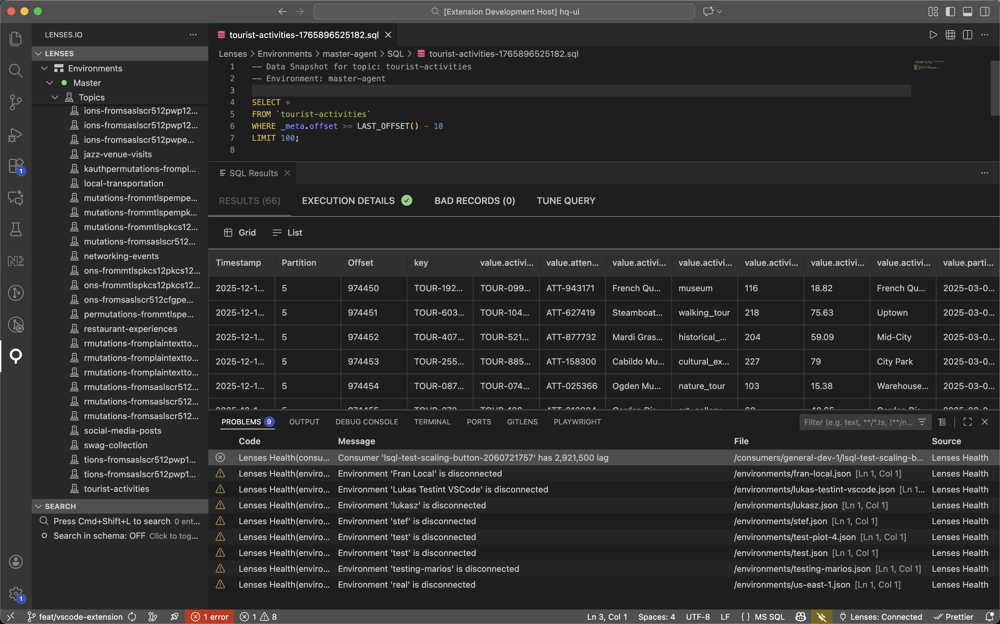
</p>

<p align="center">
  <strong>Manage your Apache Kafka infrastructure directly from Visual Studio Code</strong>
</p>

<p align="center">
  <a href="https://open-vsx.org/extension/lensesio/lenses-vscode">
    
  </a>
  <a href="https://marketplace.visualstudio.com/items?itemName=lensesio.lenses-vscode">
    
  </a>
  <a href="https://github.com/lensesio/lenses-vscode">
    
  </a>
  <a href="https://github.com/lensesio/lenses-vscode/issues">
    
  </a>
</p>

<p align="center">
  <a href="#key-features">Features</a> •
  <a href="#installation">Installation</a> •
  <a href="#quick-start">Quick Start</a> •
  <a href="#commands">Commands</a> •
  <a href="#settings">Settings</a>
</p>

---

## Key Features

[Lenses.io](https://lenses.io) for VS Code brings the power of Lenses directly into your development environment. Connect to multiple Kafka environments, create and query topics, insert messages, manage users, roles and permissions, search across different entities, compare configurations, and monitor your Kafka infrastructure - all without leaving VS Code.

- **⚡ Environment Creation** — Create and provision new Kafka environments with guided workflow
- **⚡ Topic Creation** — Create new Kafka topics with full schema validation and autocompletion
- **⚡ Topic Insert Messages** — Insert messages into topics with schema validation and autocompletion
- **⚡ Schema Registry** — Browse Schema Registry subjects per environment, view schemas in VS Code's native JSON editor, and register new subjects with full schema validation
- **⚡ Tree View Navigation** — Browse environments, topics, schemas, connectors, and IAM resources
- **⚡ Topic actions from breadcrumbs** — Click the topic segment in the editor breadcrumb (or use **Lenses: Topic Actions** in the editor title) to run the same commands as the tree topic menu (data snapshot, configuration, insert messages, etc.)
- **⚡ Real-time SQL Queries** — Query topics with Data Snapshot or stream live data in real-time
- **⚡ Favourites & Saved Queries** — Favourite topics and save SQL queries for quick access
- **⚡ IAM Management** — Create and manage users, groups, roles, and service accounts
- **⚡ Configuration Comparison** — Compare topics, schemas, groups, and roles across environments
- **⚡ Health Monitoring** — View Kafka health issues in VS Code's Problems panel
- **⚡ Global Search** — Instantly find any entity with fuzzy search (`Cmd+Shift+L`)
- **⚡ Copilot agent tools** — After connecting, use GitHub Copilot **Agent** chat with tools enabled: reference `#lensesExtensionSql`, `#lensesExtensionDoc`, `#lensesExtensionListing`, `#lensesExtensionTopic`, `#lensesExtensionEnv`, `#lensesExtensionCompare`, `#lensesExtensionSearch`, `#lensesExtensionOps`, or `#lensesExtensionSchema` to run Lenses SQL, open entities and listings, drive topic/environment/schema registry flows, diffs, search/index, and more (required VS Code 1.96 or newer).

---

## Installation

### From VS Code Marketplace

1. Open VS Code
2. Go to Extensions (`Cmd+Shift+X` / `Ctrl+Shift+X`)
3. Search for "**Lenses.io**"
4. Click **Install**

### From VSIX File

```bash
code --install-extension lenses-vscode-x.x.x.vsix
```

---

## Quick Start

### 1. Connect to Your Lenses Instance

Click the **Lenses.io** icon in the Activity Bar, then click **Connect to Lenses**.

<!-- Screenshot: Login flow -->
<!--  -->

Enter your:
- **URL** (e.g., `https://lenses.your-company.com` or `http://localhost:9991`)
- **Username**
- **Password**

Or use **Sign in with OAuth (browser)** when your Lenses instance supports OAuth 2.0 (supported from Lenses 6.2.0 or newer). Click the welcome link or run **Lenses: Sign in with OAuth (browser)** from the Command Palette. The extension opens your system browser for authentication and handles the callback automatically. If your server does not support dynamic client registration, set `lenses.oauthClientId` in VS Code settings.

### 2. Explore the Tree View

Once connected, you'll see your Kafka infrastructure organized in a tree:

<!-- Screenshot: Tree view -->
<!--  -->

- **Environments** — See all your connected Kafka environments with their health status at a glance
- **All Topics** — Browse topics across every environment in one place
- **IAM** — Manage users, groups, roles, and service accounts from a single tree

---

### GitHub Copilot / Language Model Tools

Connect to Lenses first. In Copilot Chat, enable **agent** mode and extension tools (see [Use tools in chat](https://code.visualstudio.com/docs/copilot/agents/agent-tools)). Destructive actions (for example delete topic or environment) still show VS Code confirmation dialogs before executing. Authentication commands are not available as tools. Requires **VS Code 1.96+**.

| Tool reference | Display name | What it does |
|---|---|---|
| `#lensesExtensionSql` | Run Lenses SQL | Opens the SQL editor for an environment and optionally runs a query immediately. Live streaming supported. |
| `#lensesExtensionDoc` | Open Lenses document | Opens any virtual document in view or edit mode — IAM entities (User, Group, Role, ServiceAccount), Topics, Connectors, Schemas, Provisioning, EnvironmentConfig, EnvironmentCreate, TopicCreate, TopicConfig. |
| `#lensesExtensionListing` | Open Lenses listing | Opens a listing panel: environments table, topics, schema registry, IAM (users / groups / roles / service accounts), or the SQL Results panel. |
| `#lensesExtensionTopic` | Topic action | Runs a topic-scoped action: data snapshot, live data, schema view, consumers, configuration, insert messages, compare across environments, open SQL tab, delete topic (with confirmation), create topic, add favourite. |
| `#lensesExtensionEnv` | Environment action | Switches the active environment, opens environment config or provisioning YAML, creates or deletes an environment (with confirmation), refreshes health. |
| `#lensesExtensionCompare` | Lenses comparison | Opens comparison wizards (topic config, topic schema, groups, roles) or performs a direct diff between two named entities across environments. |
| `#lensesExtensionSearch` | Lenses search & index | Opens the global search panel or drives search index actions (rebuild, start/stop/pause/resume indexing, validate, view stats). |
| `#lensesExtensionOps` | Lenses misc command | Miscellaneous commands: refresh tree/favourites/notifications, stop SQL, clear results, apply/save changes, schema version actions, connector/consumer group ops, notification management. |
| `#lensesExtensionSchema` | Schema Registry action | Manages schema registry subjects: open, edit, create, delete subject or version, version history, cross-environment comparison, favourites. Specify both versions or both environments for instant diffs without prompts. |

---

## Features

### Environments Dashboard

View and search all your Kafka environments with status indicators.

<!-- Screenshot: Environments listing -->
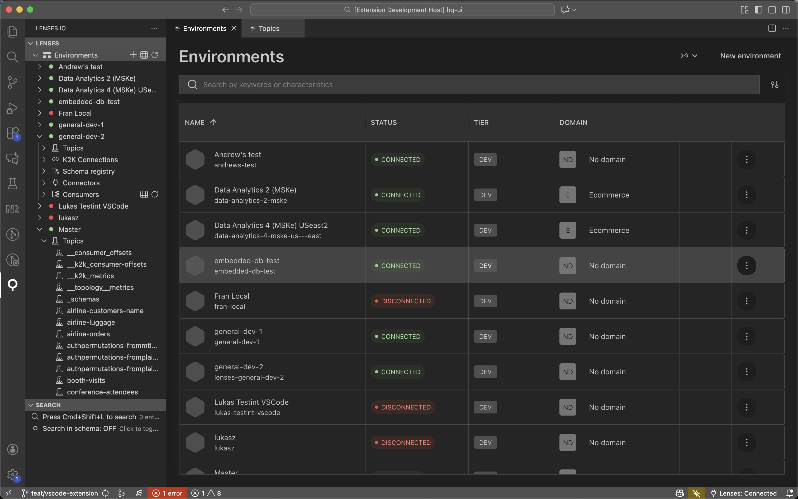

- Each environment shows a green or red indicator so you can see at a glance whether the Lenses agent is connected
- Click any environment name to explore its topics, schemas, and connectors

### Environment Creation

Create new Kafka environments with a guided workflow directly from VS Code.

<!-- Screenshot: Environment creation -->
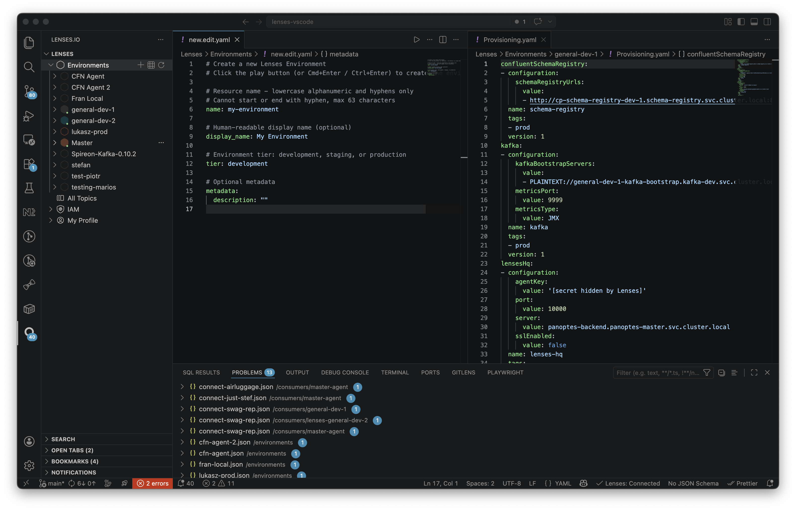

1. Click the "+" icon on Environments or use Command Palette → **Lenses: Create Environment**
2. YAML editor for environment profile with full schema validation
3. After creation, deploy the agent: if your Lenses HQ is **local** (e.g. localhost or private network), you can run or paste a Docker command, **copy the agent key** for later, or skip. If you are connected to a **remote/cloud** HQ, the extension does not offer local Docker (it would not connect); you get a short explanation and can **copy the agent key** to deploy where your HQ can reach the agent.
4. When using local Docker from the extension, connection polling runs until the agent connects (or you cancel)
5. Transition to provisioning configuration once connected

The guided workflow walks you through environment definition and agent handoff; remote setups rely on copying the agent key into your own deployment process.

### Topic Creation

Create new Kafka topics directly from VS Code with full schema validation and autocompletion.

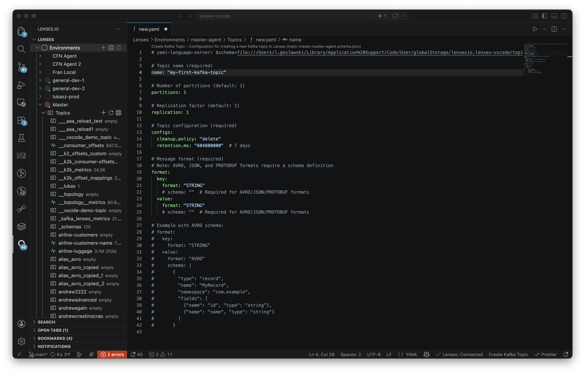

To create a new topic, just click the "+" icon next to the Topics section in the tree, or open the Command Palette and choose **Lenses: Create Topic**. You'll be taken to a YAML editor with instant schema validation and smart autocompletion to help you fill in details like partitions, replication, and any other Kafka topic settings you need. Once you hit "Create," your new topic will show up in the list right away—even before the backend has fully finished its setup. For best results, give it a moment before working with the topic, as it may take a little time (sometimes a few minutes) for everything to be ready behind the scenes.

### Topic Insert Messages

Insert messages directly into Kafka topics with full schema validation and autocompletion.

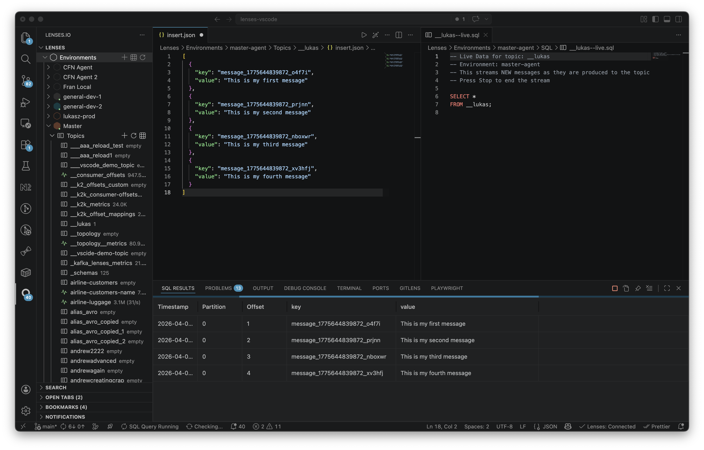

To quickly add test messages to any topic, just right-click it and choose **Insert Messages**. You’ll get an easy-to-use JSON editor that checks your input in real time against the topic's schema. The editor can even generate sample messages for you, based on the topic’s AVRO or JSON schema. You can provide a key, value, and optional headers, then hit the Play button to send your messages. As soon as they’re inserted, you’ll jump straight to a pre-filled SQL query so you can view your new data right away. If there are any issues, errors are shown inline and connected to VS Code’s Problems panel, making fixes simple.

### Topics & SQL Queries

Browse and query topics with the integrated SQL editor.

<!-- Screenshot: Topics listing -->
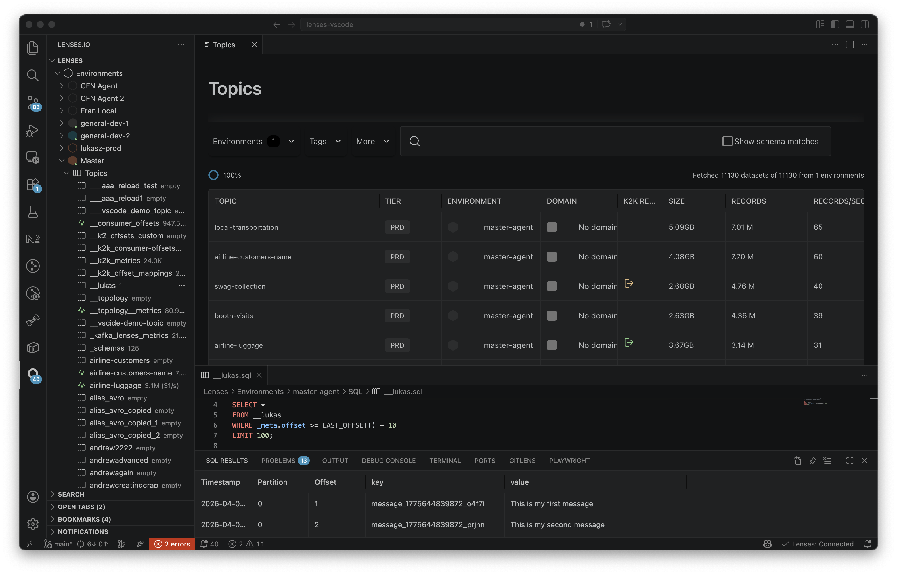

**Data Snapshot** — Click directly on any topic or right-click and select **Data Snapshot** to query historical data with SQL:

<!-- Screenshot: SQL Query -->
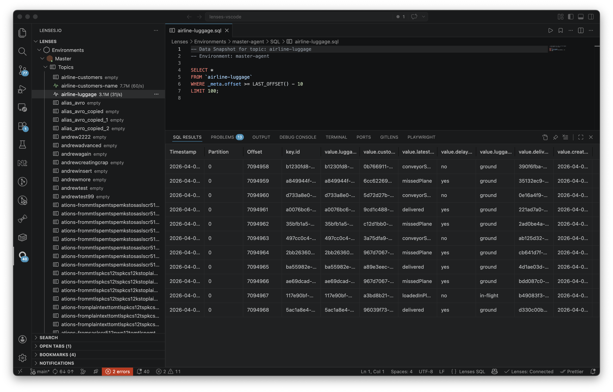

```sql
SELECT *
FROM my-topic
WHERE _meta.offset >= LAST_OFFSET() - 10
LIMIT 10;
```

Press `Cmd+Enter` to run the query or click the Play icon in the top right corner. Results appear in the bottom panel below the editor.

**Live Data** — For real-time streaming, right-click on a topic and select **Live Data**. This opens a streaming SQL query panel, continuously showing new records as they arrive.

```sql
SELECT *
FROM my-topic
```

- You can stop the stream whenever you like and resume later
- Add SQL filters to narrow down what you see in real time
- Keep an eye on high-throughput topics, as they can increase memory and CPU usage

Results appear in an interactive data grid in the bottom panel, showing all message fields with sorting and filtering. You can control live data behavior with the `lenses.sql.liveData.maxRecords` and `lenses.sql.liveData.rateWarningEnabled` settings.

### Topic Configuration

Edit topic configurations directly in VS Code's native JSON editor.

<!-- Screenshot: Topic Configuration -->
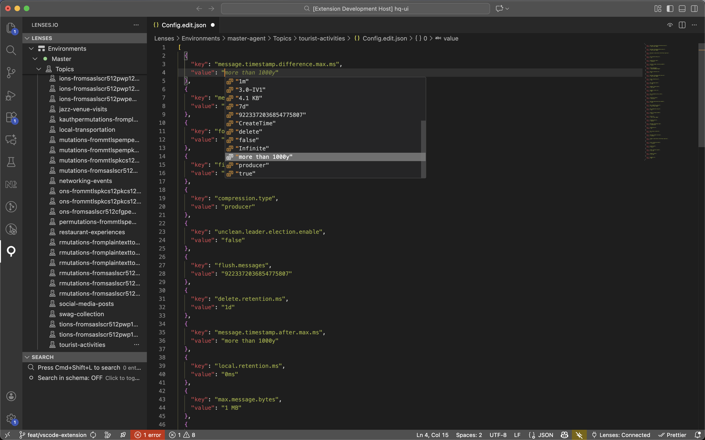

- JSON schema validation highlights errors inline as you type
- Hover over any property to see its documentation
- When you apply changes, only the values you actually modified are sent to the API

### Topic Schema

View and manage topic schemas with version history.

<!-- Screenshot: Topic Schema -->
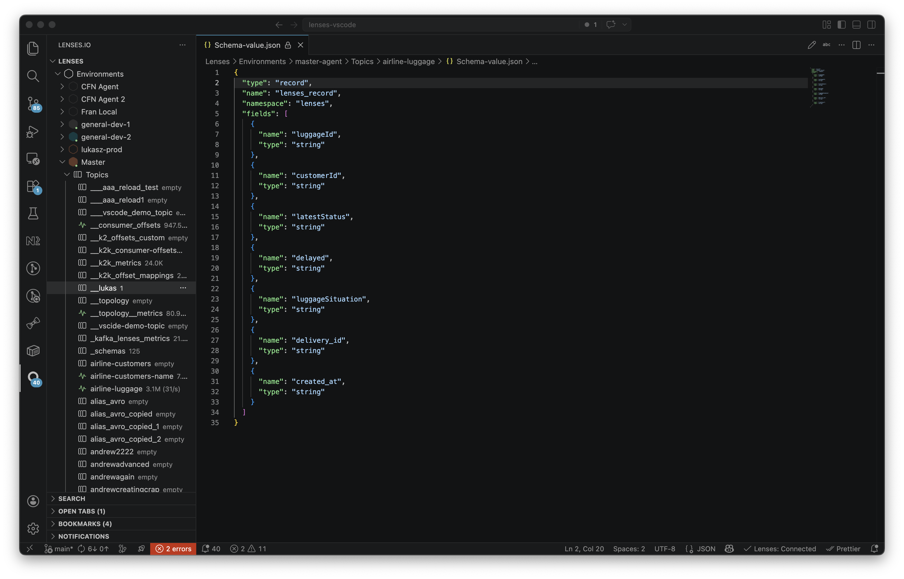

- View both key and value schemas for any topic
- Browse through previous versions using the version dropdown
- Compare any two schema versions side by side to see what changed
- Edit schemas directly and apply updates from VS Code

### Schema Registry

Browse and manage Schema Registry subjects for each environment, right next to its Topics node in the tree.

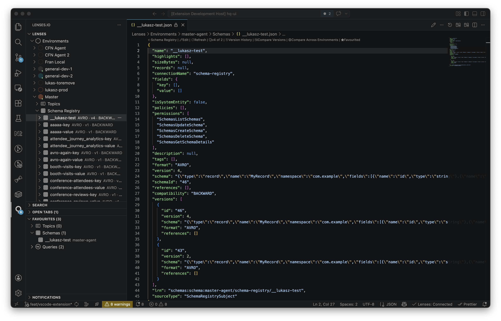

- Click the **Schema Registry** node under any environment to load every subject; the inline icons let you create a new subject (`+`), refresh the list, or open a full listing webview (`$(table)`).
- Click any subject to view its latest schema directly in VS Code's native JSON editor — no extra panels, full syntax highlighting, foldable AVRO/JSON/Protobuf payloads. Inline CodeLens actions appear above the document to edit, refresh, browse version history, compare versions or environments, and toggle favourites.
- Click the **+** icon (or run **Lenses: Create Schema Subject**) to open a JSON-Schema-validated template document. Fill in `subjectName`, `format` (AVRO / JSON / PROTOBUF), and the `schema` itself; the editor autocompletes valid options and highlights mistakes inline. Saving the document registers the subject through the Lenses API and immediately opens it for review.
- Browse version history for any subject and compare versions side by side using VS Code's native diff editor. Cross-environment comparison lets you spot schema drift between staging and production.
- Delete subjects or individual versions from the tree context menu with confirmation prompts.
- Schema Registry subjects are included in the global search index — press `Cmd+Shift+L` to find any subject instantly across environments.

### IAM Management

Manage identity and access directly from VS Code.

<!-- Screenshot: IAM -->
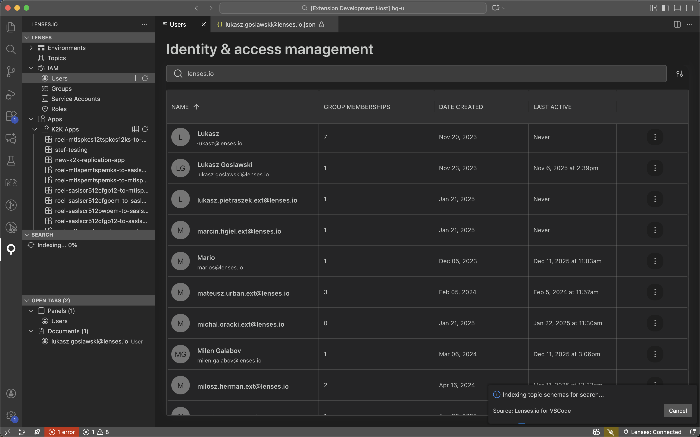

- **Users** — Create, view, and delete user accounts for your Lenses instance
- **Groups** — Organize users into groups and assign roles to control what each group can access
- **Roles** — Define fine-grained permissions that specify exactly which actions are allowed on which resources
- **Service Accounts** — Manage credentials for API and programmatic access

All IAM entities open in a JSON editor with full schema validation, so you get instant feedback if something is misconfigured. Role names and permissions autocomplete as you type, and changes you make are reflected in real time across any open tabs.

### Configuration Comparison

Compare entities across environments using VS Code's native diff editor.

<!-- Screenshot: Diff view -->
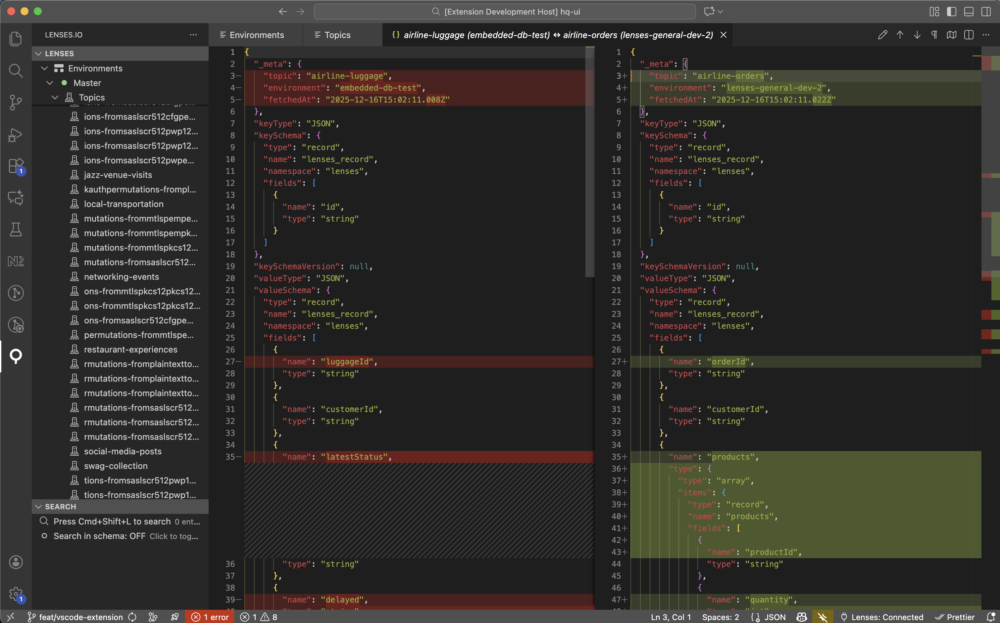

You can compare topic configurations and schemas (both key and value) across different environments to spot differences between staging and production. For global entities like groups and roles, compare any two side by side regardless of environment.

Start a comparison from the Command Palette or by right-clicking an entity in the tree view.

### Health Monitoring

Monitor Kafka infrastructure health in VS Code's Problems panel.

<!-- Screenshot: Health monitoring -->
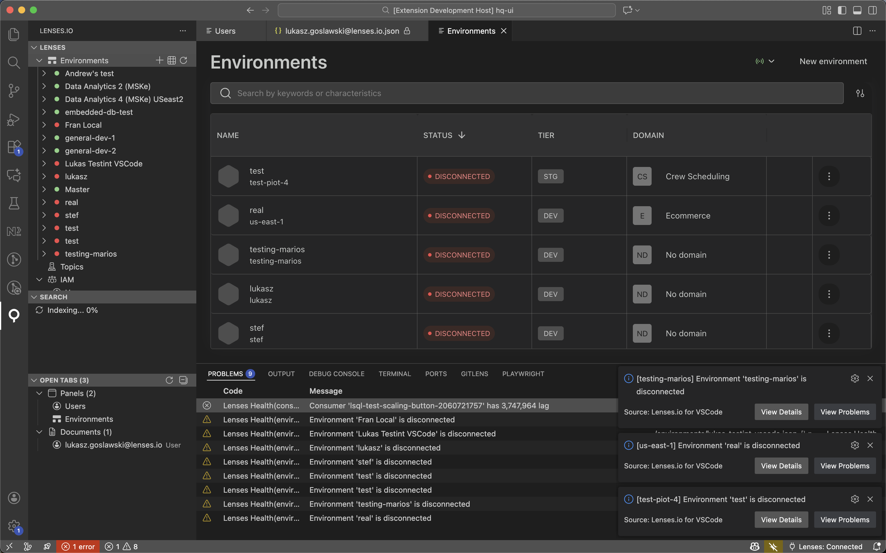

- Warns you when consumer lag crosses your configured thresholds, so you can catch slow consumers early
- Alerts you when a connector fails or enters an unhealthy state
- Flags environment connectivity issues if an agent goes offline
- Optionally shows real-time toast notifications for critical issues so you don't miss anything while coding

### Favourites & Saved Queries

Keep your frequently accessed topics and queries at your fingertips.

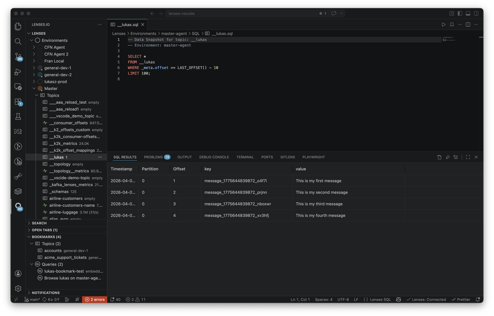

**Topic Favourites** — Right-click any topic and choose **Add to Favourites** to pin it for quick access. Clicking a favourited topic opens a pre-configured SQL query right away, and you can remove favourites with a single click when you no longer need them.

**Saved Queries** — Save any SQL query you want to reuse by pressing `Cmd+Shift+P` → **Lenses: Save Query**, or click the star icon in the SQL editor. Your saved queries appear in the sidebar so you can open them in a new tab with one click, and rename or delete them from the context menu.

All favourites and saved queries sync with your Lenses.io web app, so your workflow carries over seamlessly between platforms.

### Global Search

Find any entity instantly with fuzzy search (requires initial indexing; very large environments may take longer to index). You can adjust search behavior, result limits, and other indexing options in the extension's settings.

<!-- Screenshot: Global search -->
<!--  -->

Press `Cmd+Shift+L` (`Ctrl+Shift+L` on Windows/Linux) to open the search panel, then start typing. Results span all your environments, topics, users, and other entities, ranked by relevance. Click any result to navigate directly to that entity in the tree or open its document.

---

## Commands

Access all commands via the Command Palette (`Cmd+Shift+P` / `Ctrl+Shift+P`).

| Command | Description |
|---------|-------------|
| `Lenses: Connect to Instance` | Connect to your Lenses.io API |
| `Lenses: Sign in with OAuth (browser)` | Connect via OAuth 2.0 browser flow |
| `Lenses: Search` | Open global fuzzy search |
| `Lenses: Switch Environment` | Quick switch between environments |
| `Lenses: Create Environment` | Create a new environment |
| `Lenses: Create Topic` | Create a new Kafka topic |
| `Lenses: Save Query` | Save the current SQL query |
| `Lenses: Compare Topic Configuration` | Compare topic configs across environments |
| `Lenses: Compare Topic Schema` | Compare topic schemas across environments |
| `Lenses: Compare Groups` | Compare groups side by side |
| `Lenses: Compare Roles` | Compare roles side by side |
| `Lenses: Refresh Health Status` | Refresh health monitoring data |
| `Lenses: Open SQL Query` | Open a new SQL query editor |
| `Lenses: Run SQL Query` | Execute the current SQL query |
| `Lenses: Sign Out` | Disconnect from the Lenses instance |

---

## Keyboard Shortcuts

| Shortcut | Action |
|----------|--------|
| `Cmd+Shift+L` | Global Search |
| `Cmd+Shift+E` | Switch Environment |
| `Cmd+Shift+Q` | Open SQL Query |
| `Cmd+Enter` | Run SQL Query (in SQL editor) |

---

## Settings

Configure the extension via VS Code Settings (`Cmd+,`).

### General

| Setting | Default | Description |
|---------|---------|-------------|
| `lenses.apiUrl` | `""` | Base URL for your Lenses.io API |
| `lenses.oauthClientId` | `""` | OAuth client ID (when dynamic registration is unavailable) |

### Health Monitoring

| Setting | Default | Description |
|---------|---------|-------------|
| `lenses.health.pollingInterval` | `30000` | Health check interval (ms) |
| `lenses.health.consumerLagWarningThreshold` | `10000` | Consumer lag warning threshold |
| `lenses.health.consumerLagErrorThreshold` | `100000` | Consumer lag error threshold |
| `lenses.health.notifications.enabled` | `false` | Enable toast notifications for critical issues |
| `lenses.health.notifications.errorOnly` | `false` | Only show error notifications |
| `lenses.health.notifications.cooldownMs` | `300000` | Notification cooldown (5 min) |
| `lenses.health.notifications.showInStatusBar` | `true` | Show unread notification count in status bar |

### Health Checks

| Setting | Default | Description |
|---------|---------|-------------|
| `lenses.health.checks.consumerLag` | `true` | Monitor consumer lag |
| `lenses.health.checks.connectorStatus` | `true` | Monitor connector status |
| `lenses.health.checks.environmentStatus` | `true` | Monitor environment health |

### SQL Queries

| Setting | Default | Description |
|---------|---------|-------------|
| `lenses.sql.liveData.maxRecords` | `5000` | Maximum records for live data streaming (0 = no limit) |
| `lenses.sql.liveData.rateWarningEnabled` | `true` | Show warning when message rate is high |
| `lenses.sql.acceptSelfSignedCerts` | `false` | Trust self-signed TLS certificates for SQL connections |

### Search Index

| Setting | Default | Description |
|---------|---------|-------------|
| `lenses.search.index.enabledEntityTypes` | all types | Entity types to include in search index |
| `lenses.search.index.autoIndexOnStartup` | `false` | Automatically start indexing when connected |
| `lenses.search.cache.enabled` | `true` | Persist search index between sessions |
| `lenses.search.cache.ttlHours` | `24` | Search index cache duration (hours) |

### Other

| Setting | Default | Description |
|---------|---------|-------------|
| `lenses.yaml.schemaValidation` | `true` | YAML schema validation for provisioning files |
| `lenses.telemetry.enabled` | `true` | Anonymous usage telemetry (respects VS Code global setting) |

---

## Requirements

- **VS Code** version 1.96.0 or higher
- A running **Lenses.io** instance with API access enabled
- Network connectivity between your machine and the Lenses API

### Recommended Extensions

- [YAML](https://marketplace.visualstudio.com/items?itemName=redhat.vscode-yaml) — Enhanced YAML editing for environment configuration

---

## Version Compatibility

**Important:** The extension version must match your Lenses.io API version (minor version compatibility).

| Extension Version | Compatible API Version |
|-------------------|------------------------|
| 6.2.x             | 6.2.y                  |

The extension will check version compatibility when connecting and display a warning if there's a mismatch. While you can continue with mismatched versions, some features may not work correctly.

**Example:**
- Extension 6.2.0 ✅ API 6.2.1 (compatible)
- Extension 6.2.0 ⚠️ API 6.1.5 (warning shown)
- Extension 6.2.0 ⚠️ API 6.3.0 (warning shown)

---

## What's New

### 6.2.2 — Schema Registry & Community Edition

- **Schema Registry** — Full subject management: browse, view, create, edit, delete, version history, cross-environment comparison, and CodeLens inline actions
- **Schema Registry in Copilot** — New `#lensesExtensionSchema` tool for managing schemas from GitHub Copilot Chat with direct-diff support
- **Schema Registry in Global Search** — Subjects are now indexed and searchable alongside topics and other entities
- **One-click Community Edition** — Install Lenses Community Edition via Docker directly from the welcome screen

### Previous Highlights (6.2.1)

- **Live Streaming in Pinned SQL Results** — Pinning a live-data query transfers the streaming session to the pinned tab
- **Actionable Health Notifications** — Remediation guidance and CodeLens actions in health documents
- **Quick Fix Actions in Problems Panel** — Lightbulb quick fixes for consumer lag, failed connectors, and disconnected environments
- **Full Topic Context Menu on Favourites** — Favourited topics now show the complete topic action menu

See the [CHANGELOG](CHANGELOG.md) for full release history.

---

## Troubleshooting

### Extension Doesn't Load

1. Ensure VS Code is version 1.96.0 or higher
2. Check the Output panel (`View → Output`) and select "Lenses.io" from the dropdown
3. Try reloading the window (`Cmd+Shift+P` → "Developer: Reload Window")

### Authentication Fails

1. Verify your URL points to the correct Lenses instance (e.g., `https://lenses.company.com`). The `/api` suffix is added automatically.
2. Check your username and password
3. Ensure your Lenses instance is accessible from your network

### Topics Not Loading

1. Check if the environment has an agent connected (green indicator)
2. Verify you have permissions to view topics
3. Try refreshing the node (right-click → Refresh)

---

## Support

- **Documentation**: [Lenses.io Docs](https://docs.lenses.io)
- **Issues**: [GitHub Issues](https://github.com/lensesio/lenses-vscode/issues)
- **Lenses.io**: [lenses.io](https://lenses.io)

---

## License

[Proprietary License](LICENSE) © 2017-2026 Lenses.io LTD

---

<p align="center">
  <sub>Built with ❤️ by the Lenses.io team</sub>
</p>
